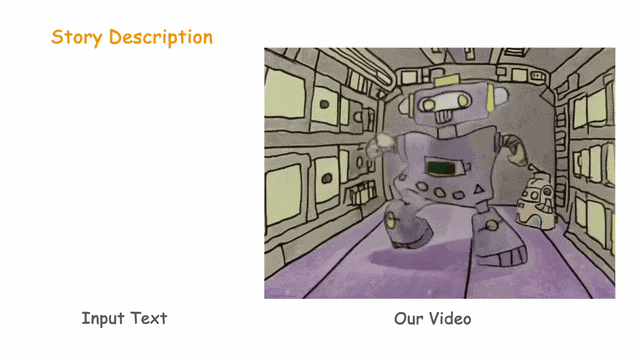
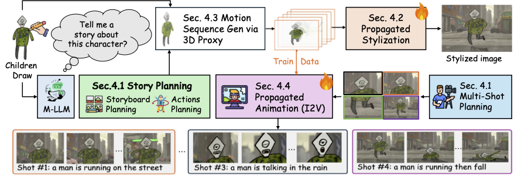

## 🧚‍♀️ FairyGen: Storied Cartoon Video from a Single Child-Drawn Character

<b>[Jiayi Zheng]() and [Xiaodong Cun](http://vinthony.github.io)</b> from [GVC Lab @ Great Bay University](http://gvclab.github.io)

[Arxiv](https://arxiv.org/abs/2506.21272) | [PDF](https://arxiv.org/pdf/2506.21272) | [Project Page](https://jayleejia.github.io/FairyGen/)

---

TL;DR: We create story videos from a single child-drawn character image.




### Main Pipeline 



We propose FairyGen, a novel framework for generating animated story videos from a single hand-drawn character, while faithfully preserving its artistic style. It features story planning via MLLM, propagated stylization, 3D-based motion generation, and a two-stage propagated motion adapter.


### Citation

```bibtex

@article{zheng2025fairygen,
      title={FairyGen: Storied Cartoon Video from a Single Child-Drawn Character}, 
      author={Jiayi Zheng and Xiaodong Cun},
      year={2025},
      eprint={2506.21272},
      archivePrefix={arXiv},
      primaryClass={cs.GR},
      url={https://arxiv.org/abs/2506.21272}, 
}

```